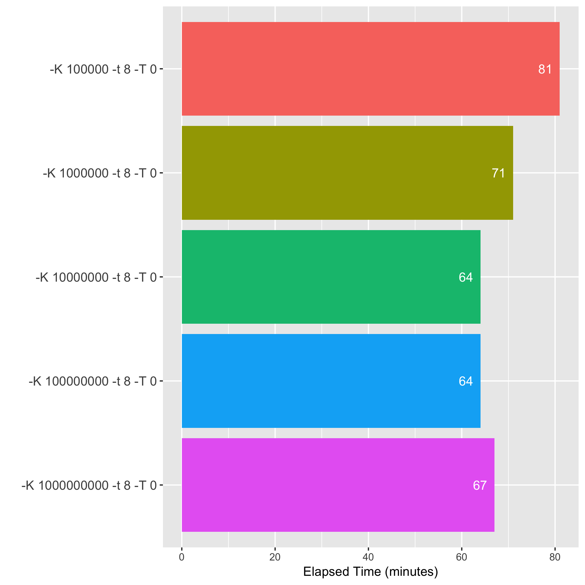
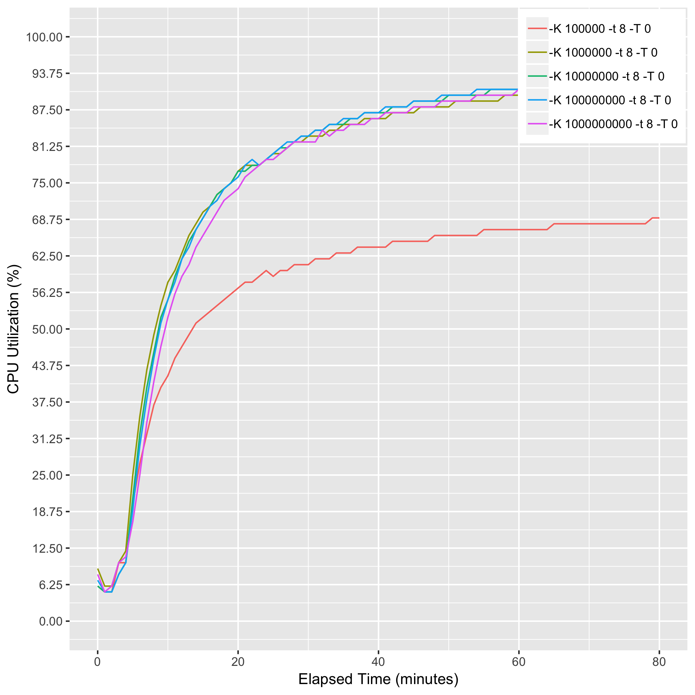
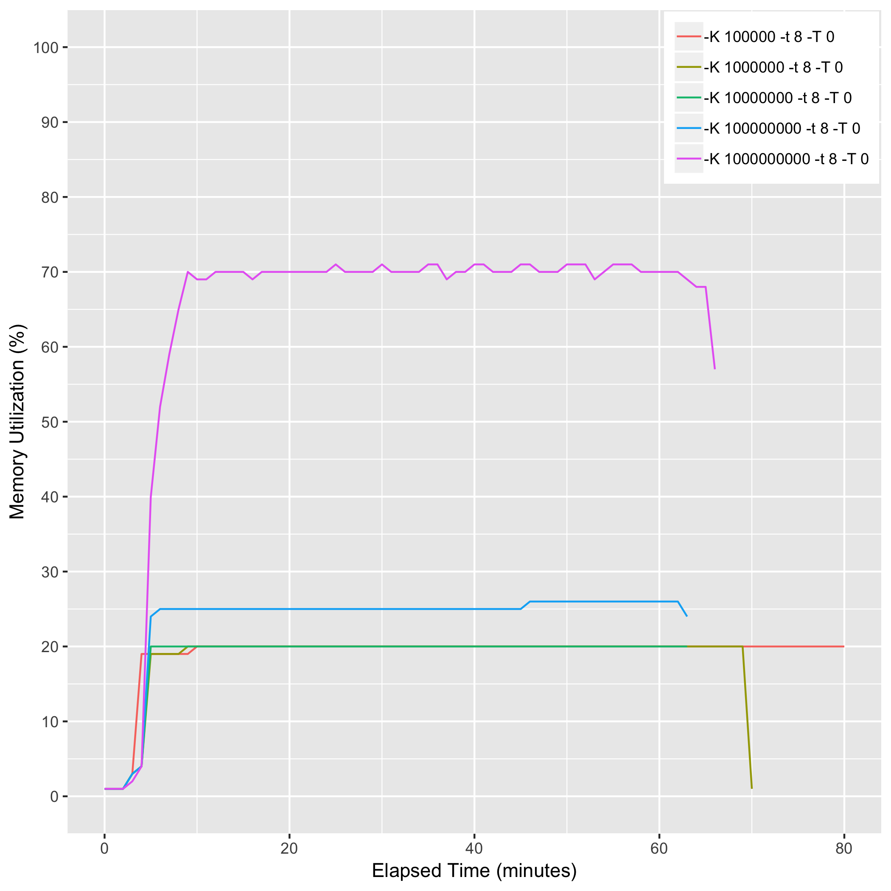
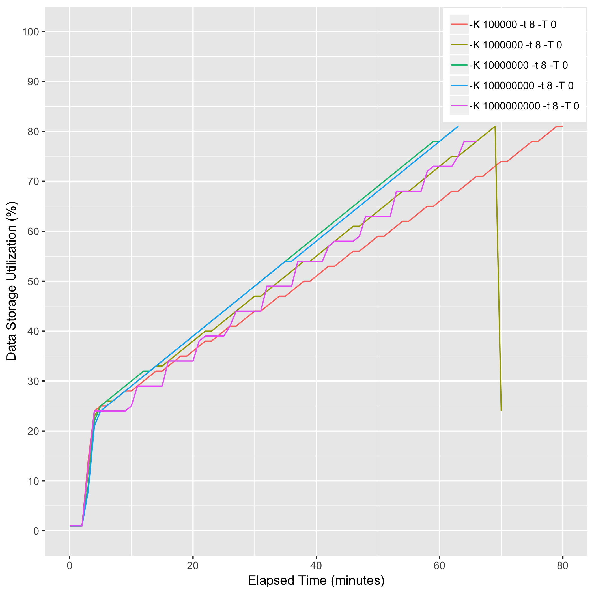

# eval_bwa_k_option_output_03

## Description
bwa mem -K {10000|100000|1000000|10000000|100000000|1000000000} -t 8 -T 0

## Computing Environment
m5.2xlarge Amazon EC2 spot instance - 8 cpu, 32GiB memory, 80GB EBS

## Running Time

## CPU Utilization

## Memory Utilization

## Disk Storage Usage

