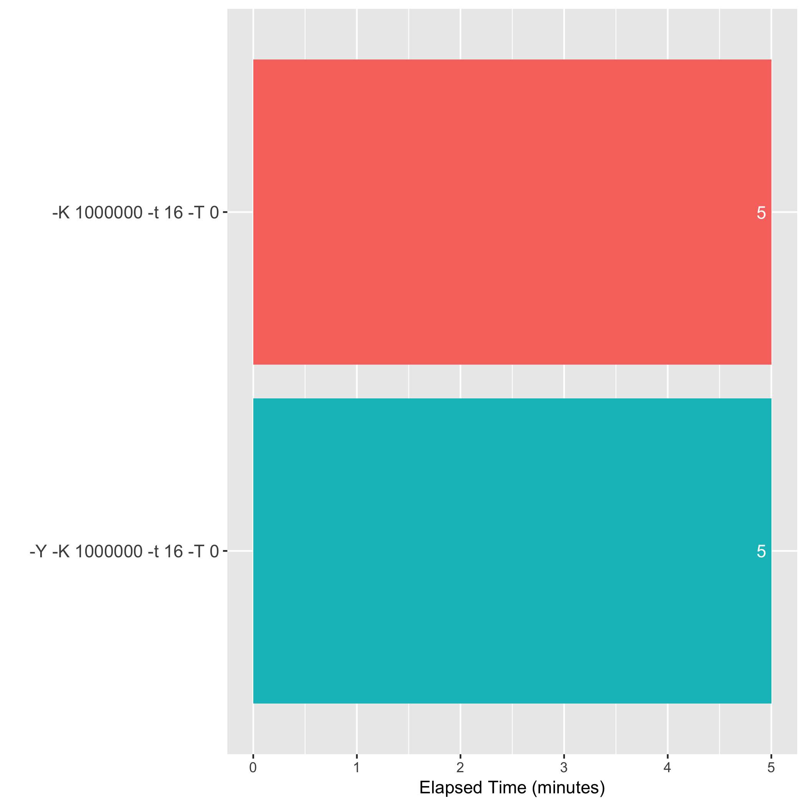
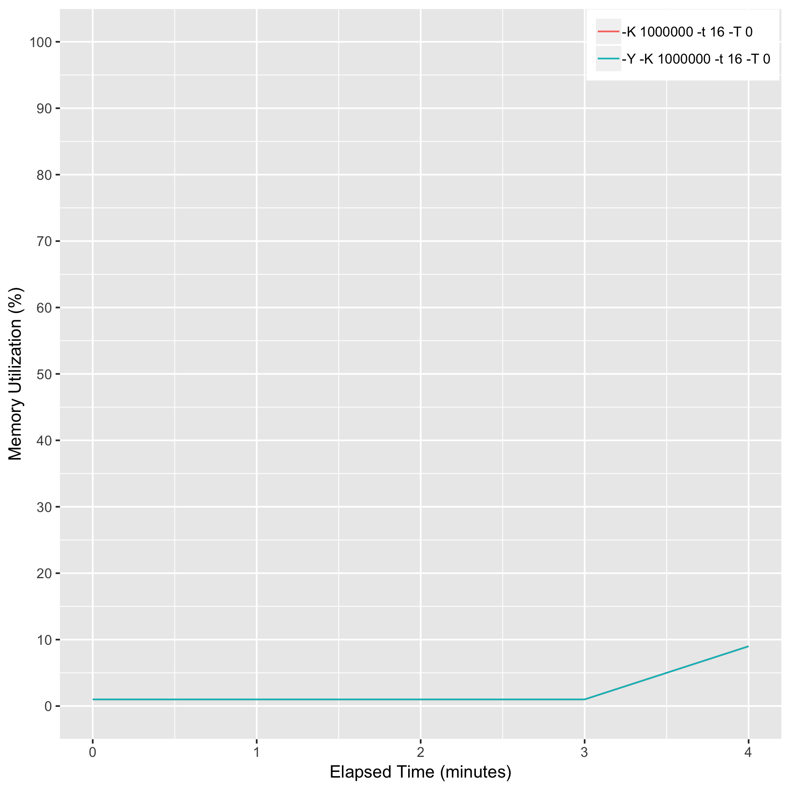

# eval_bwa_y_option_output

## Description
bwa mem -K 10000000 [-Y] -t 16 -T 0

## Computing Environment
m5.4xlarge Amazon EC2 spot instance - 16 cpu, 64GiB memory, 80GB EBS

## Running Time

## CPU Utilization

## Memory Utilization

## Disk Storage Usage

