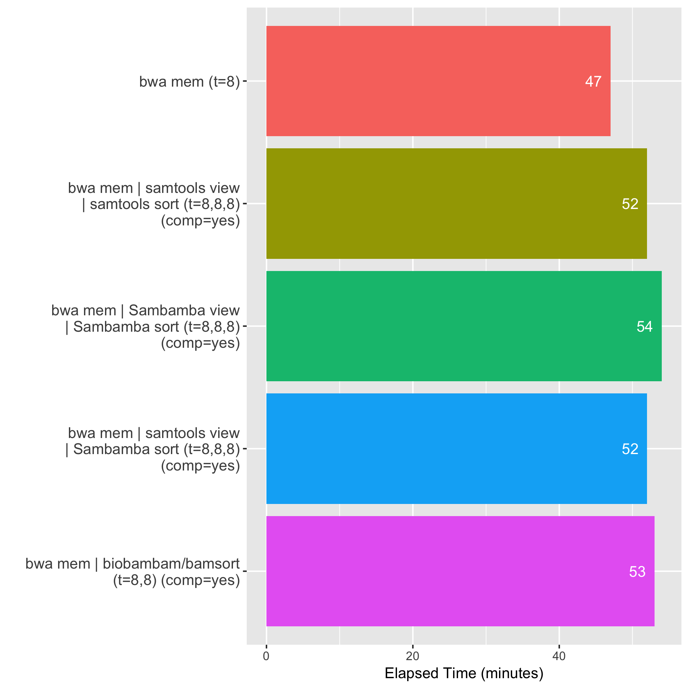
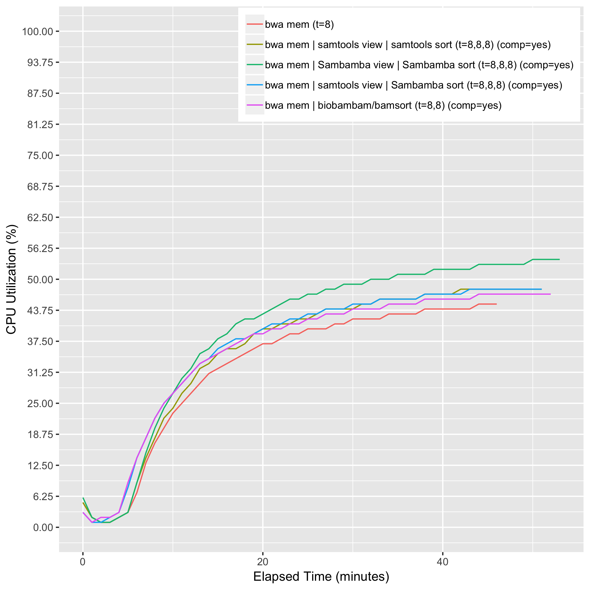
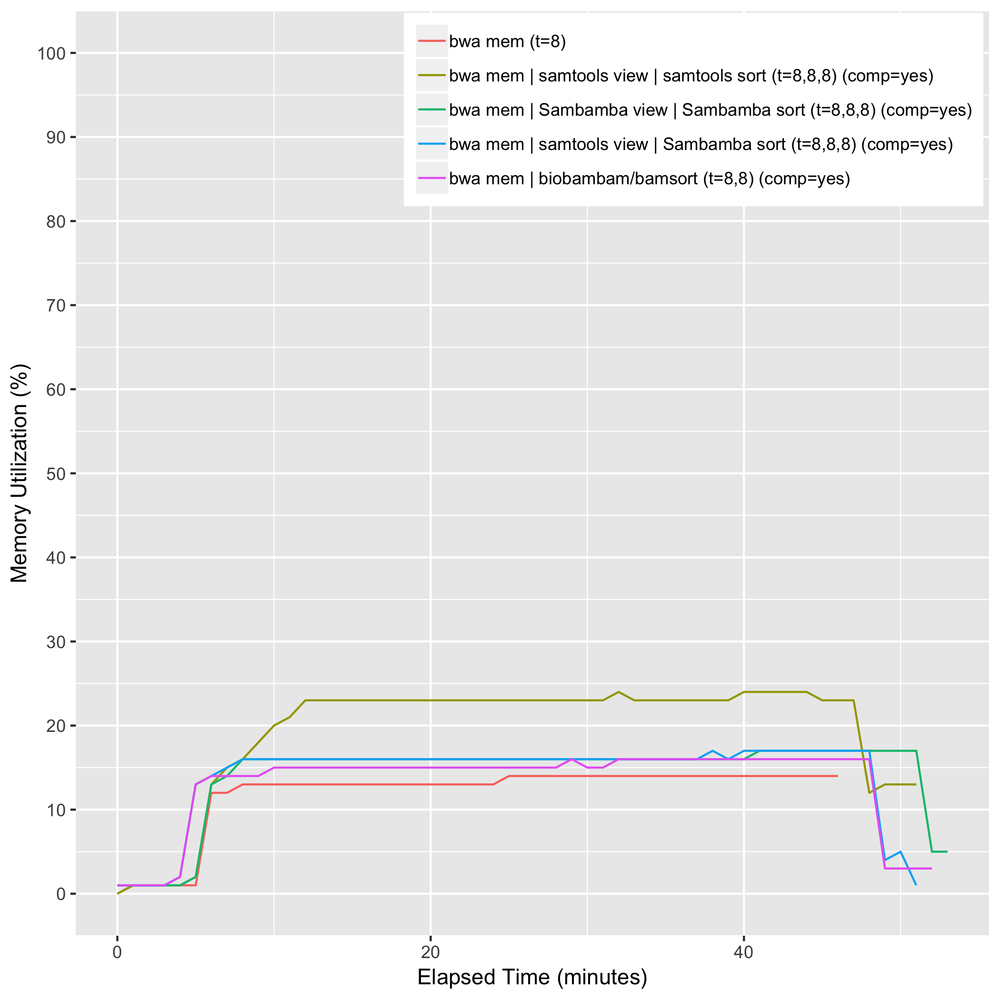
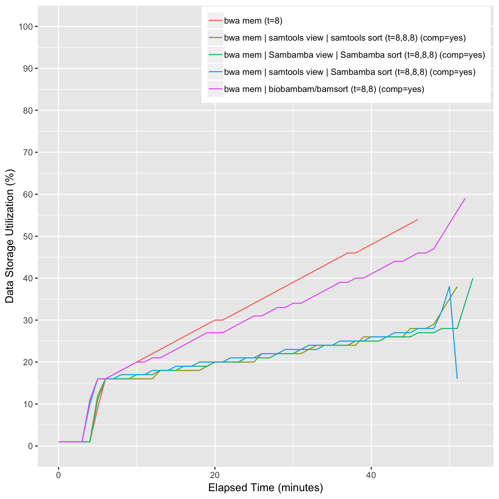

# eval_combination_02

## Description

## Computing Environment
m5.4xlarge Amazon EC2 spot instance - 16 cpu, 64GiB memory, 120GB EBS

## Running Time

## CPU Utilization

## Memory Utilization

## Disk Storage Usage

