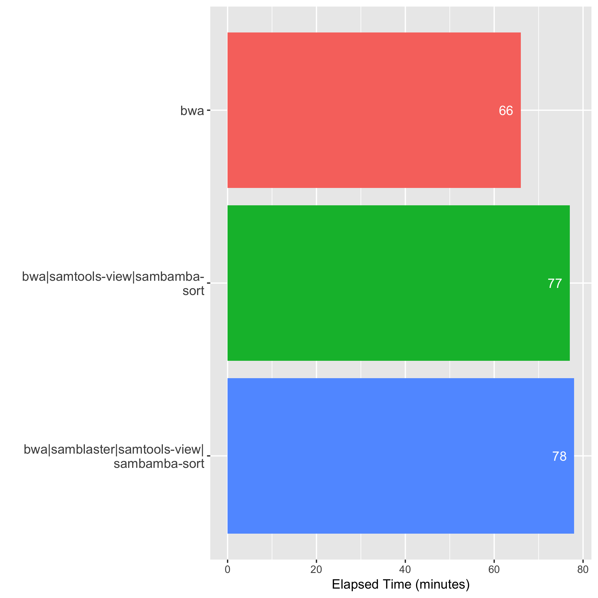
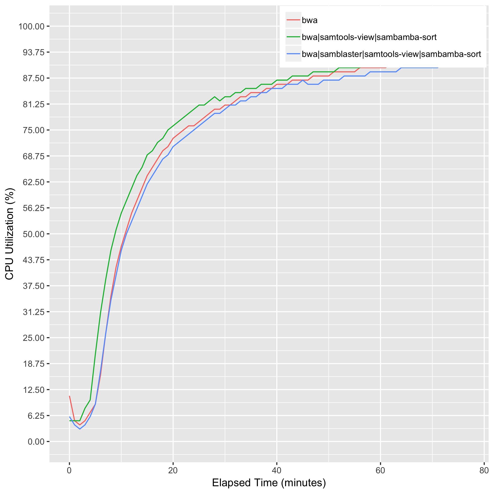
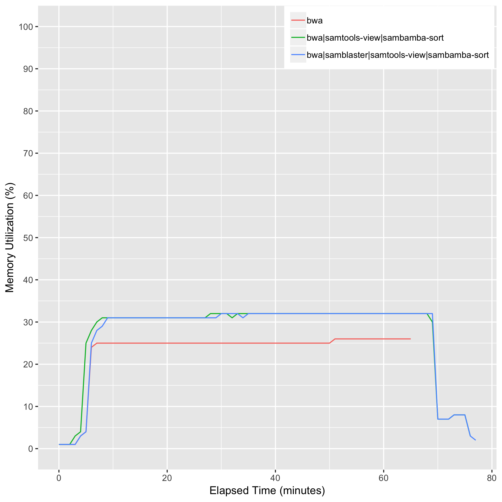
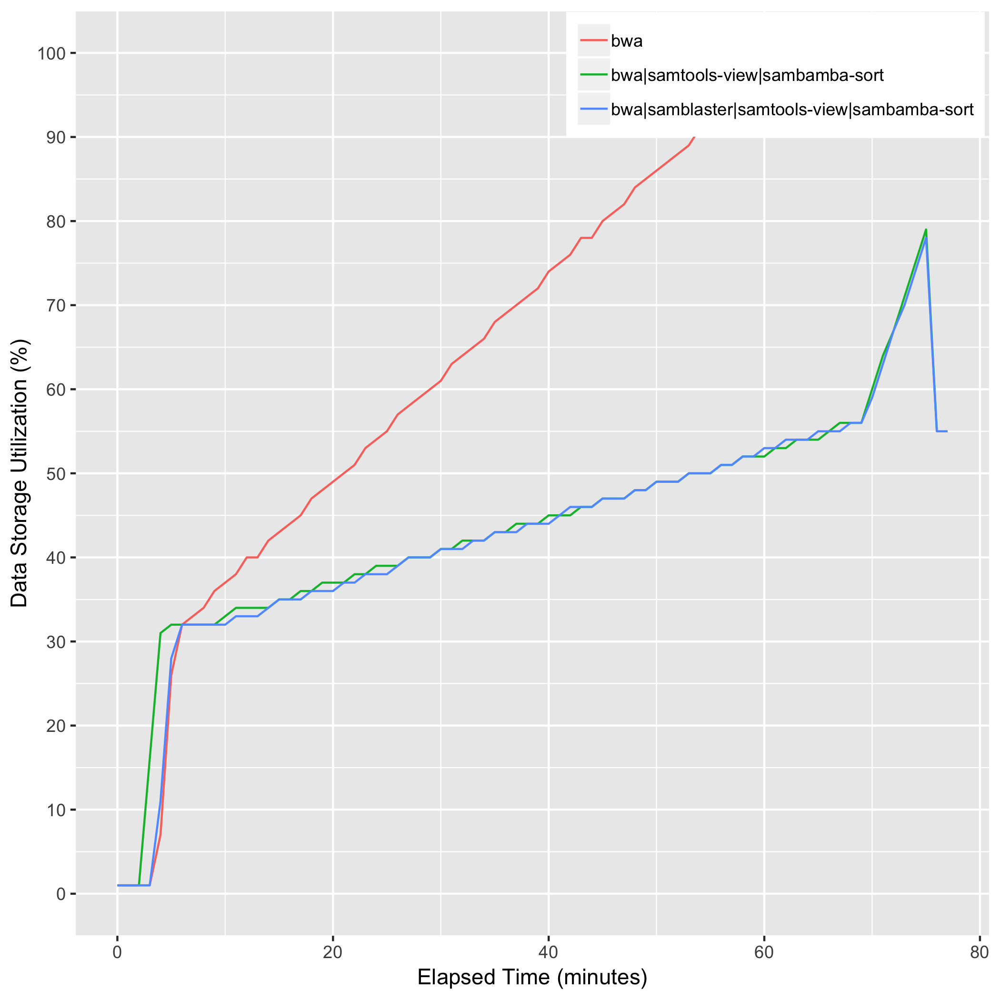

# create_name_sorted_bam

## Description

## Computing Environment
m5.2xlarge Amazon EC2 spot instance - 8 cpu, 32GiB memory, 60GB EBS

## Running Time

## CPU Utilization

## Memory Utilization

## Disk Storage Usage

