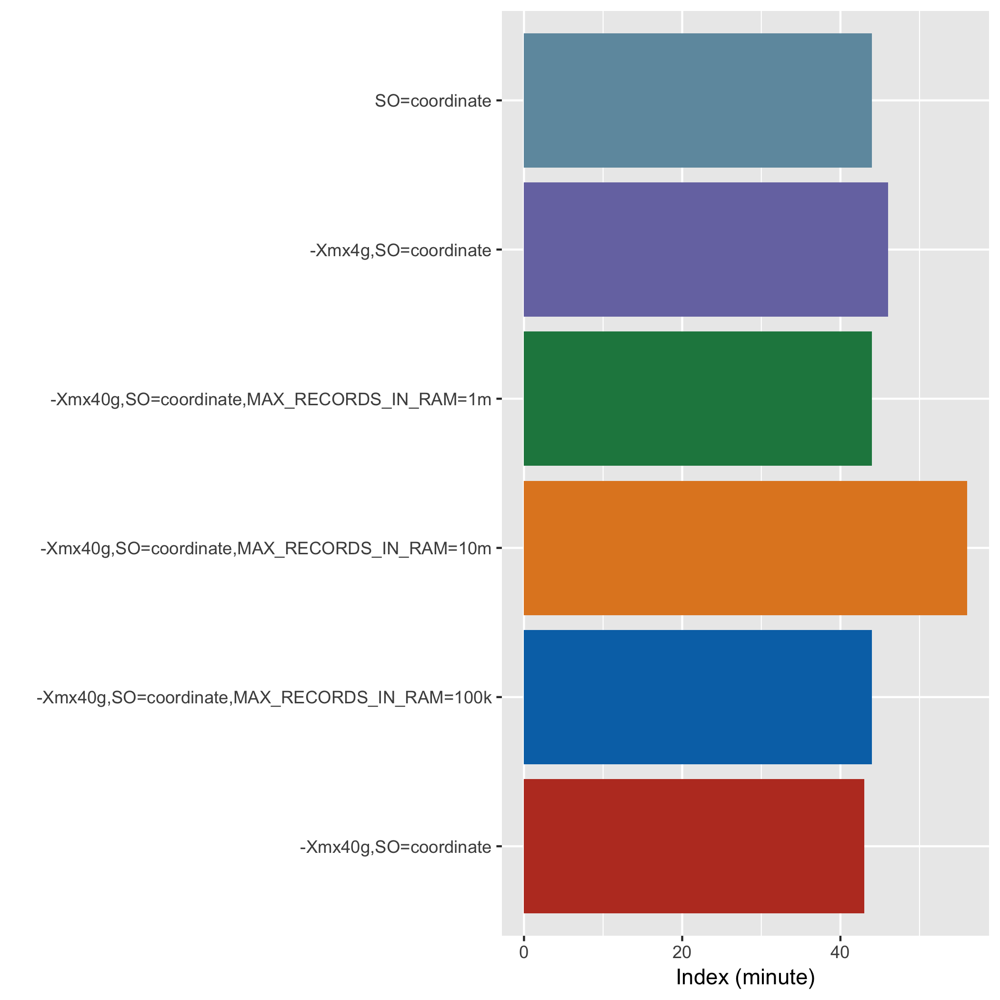
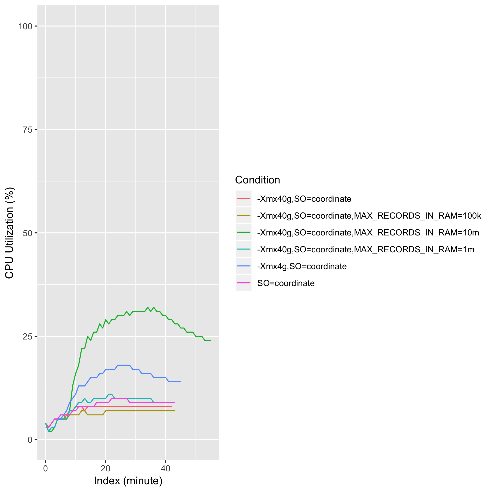
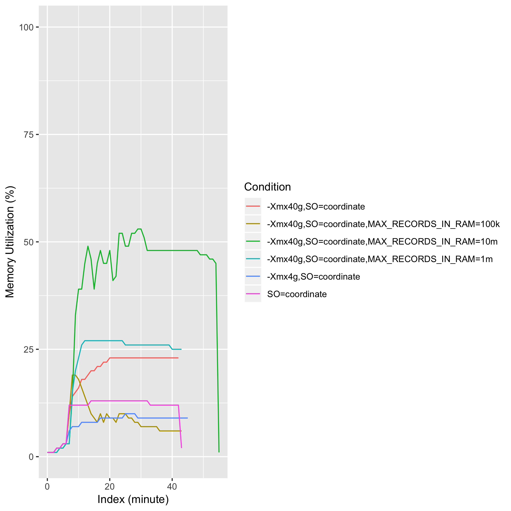
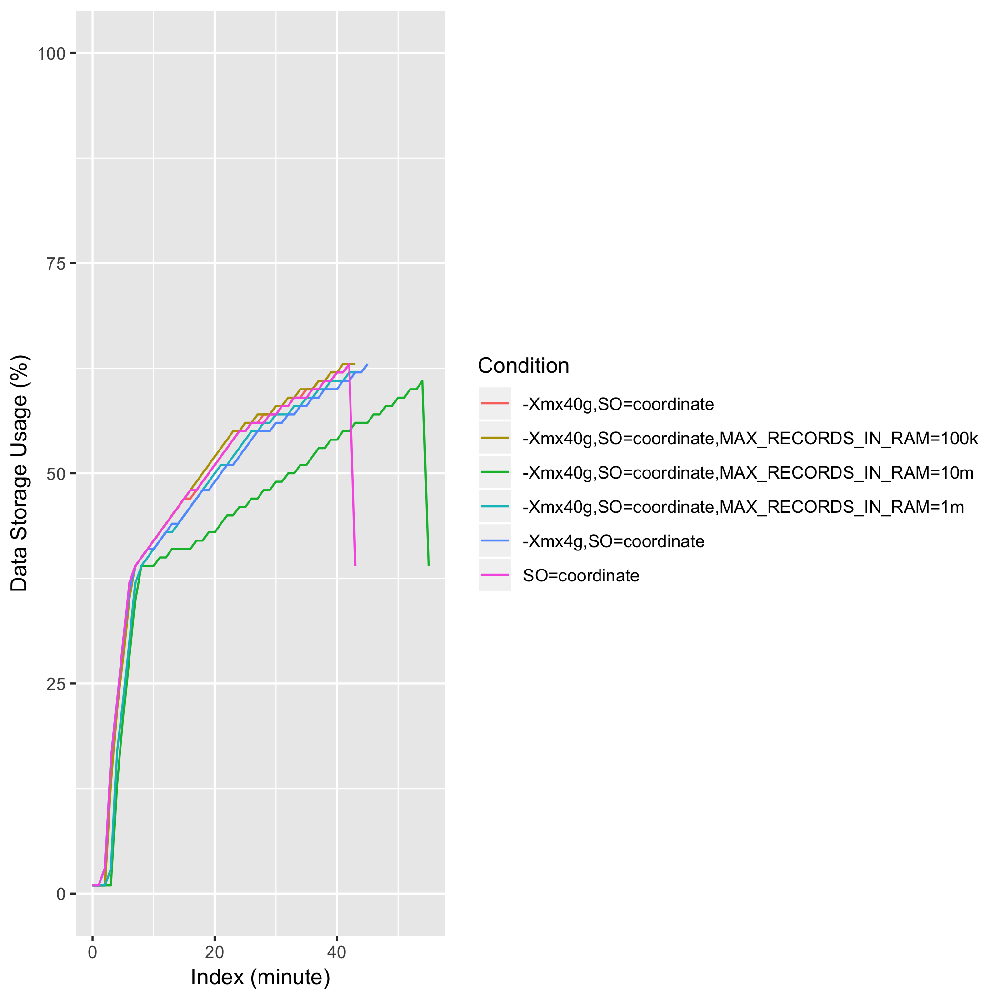

# eval_picard_sort_01

## Description
java <java_option> -jar picard.jar SortSam I=<sam_file> O=<bam_file> SO=<sort_order> <picard_option>

## Computing Environment
aws m5.4xlarge EC2 spot instance - 16 cpu, 64GiB memory, 120GB EBS

## Running Time

## CPU Utilization

## Memory Utilization

## Disk Storage Usage

