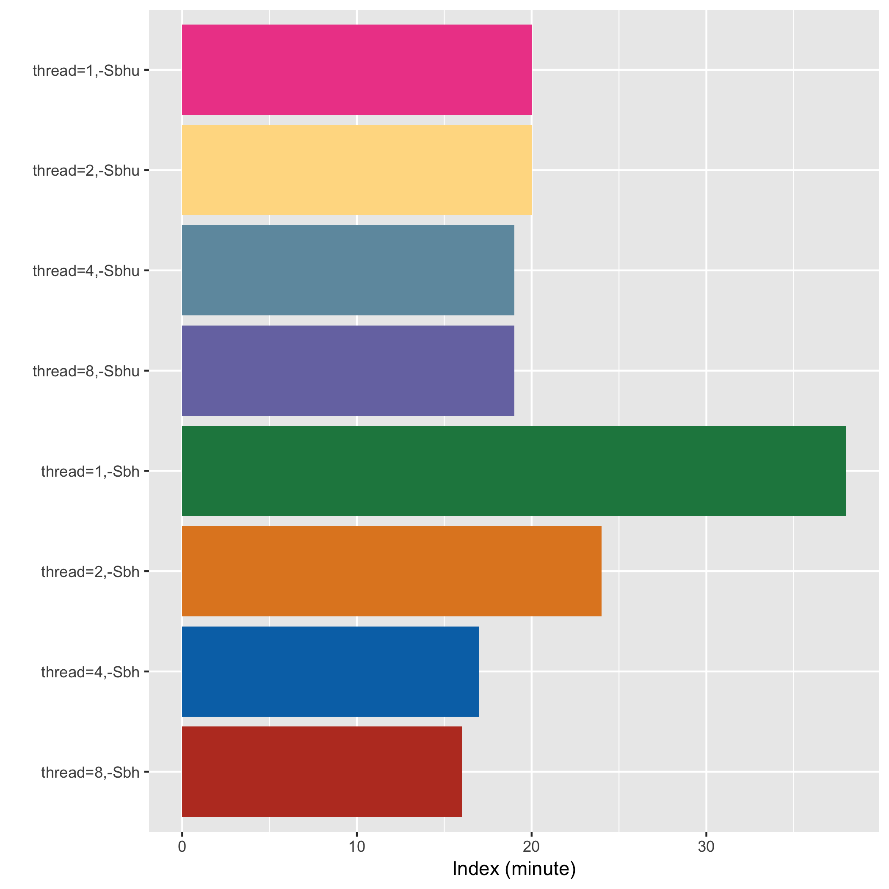
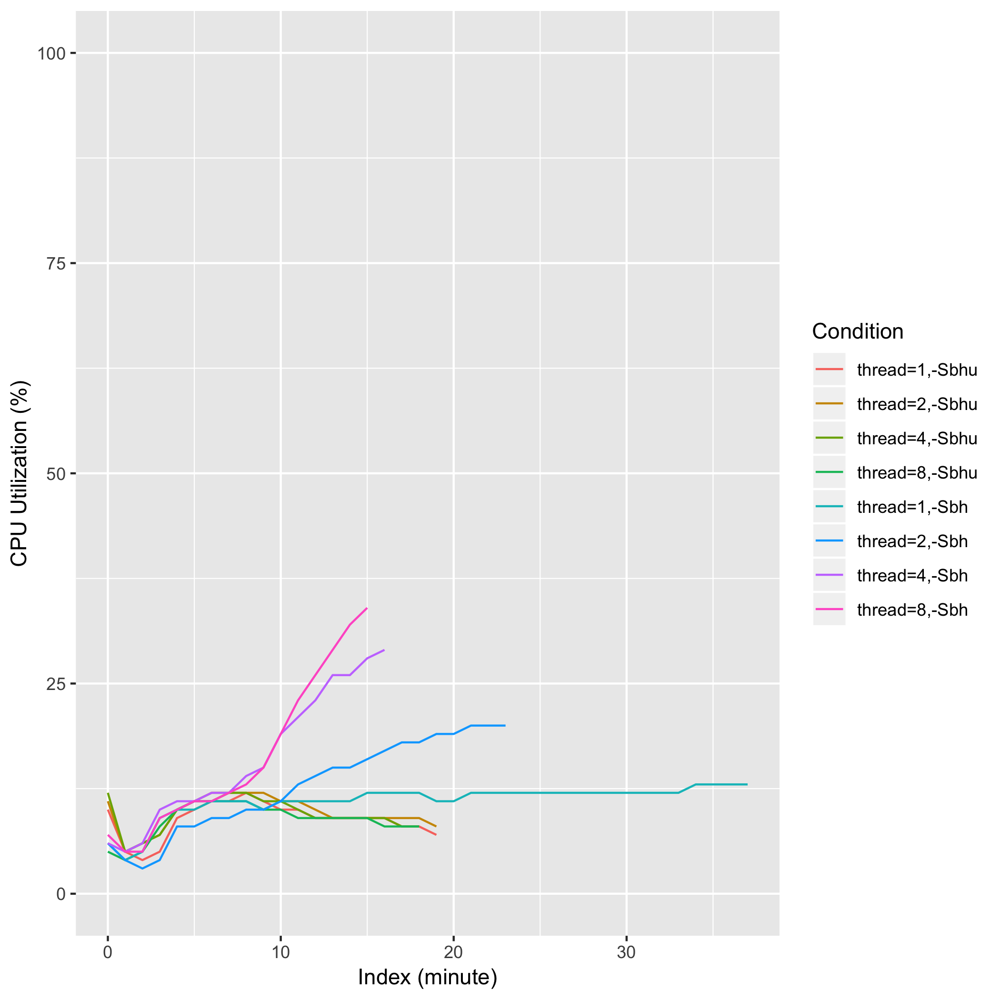
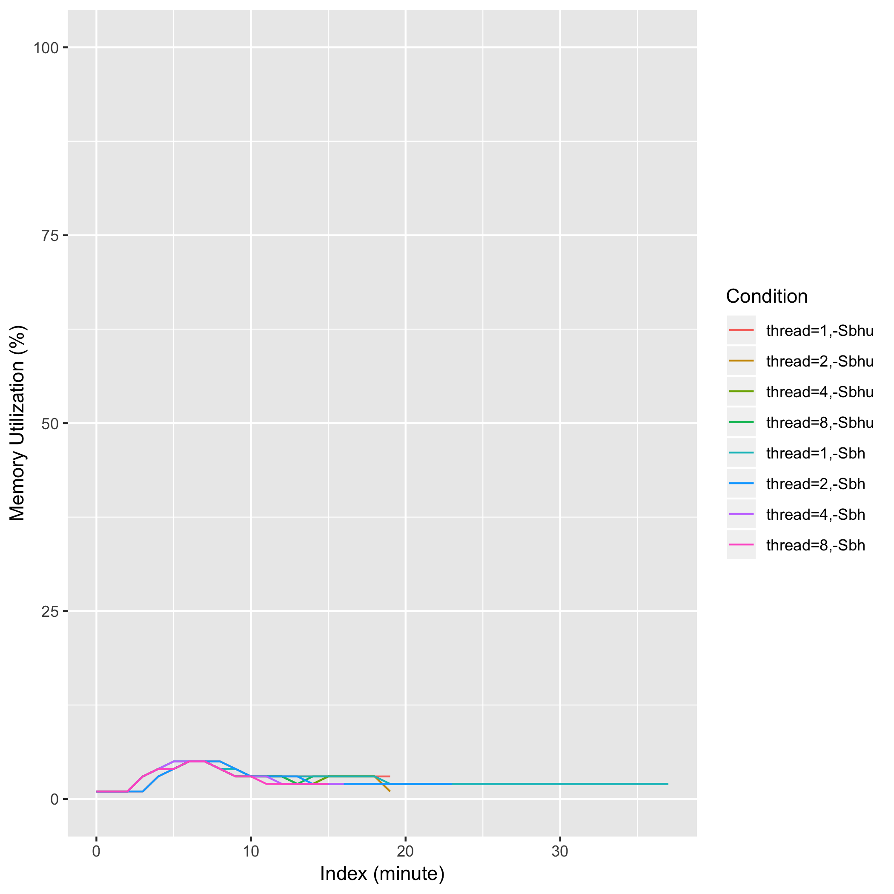
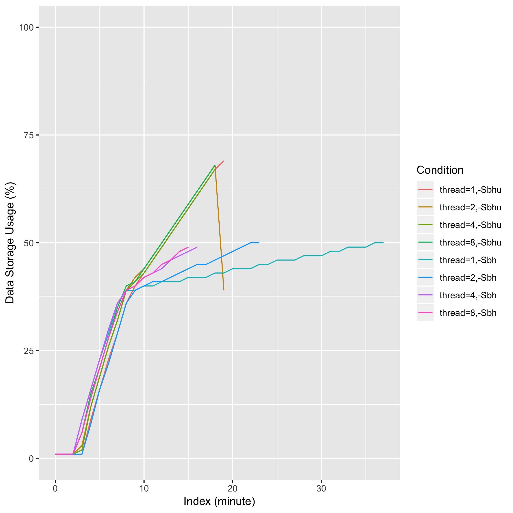

# eval_samtools_view_thread

## Description
samtools view -@ {thread} -Sbh[u] {sam_file}

## Computing Environment
aws m5.2xlarge EC2 spot instance - 8 cpu, 32GiB memory, 120GB EBS

## Running Time

## CPU Utilization

## Memory Utilization

## Disk Storage Usage

