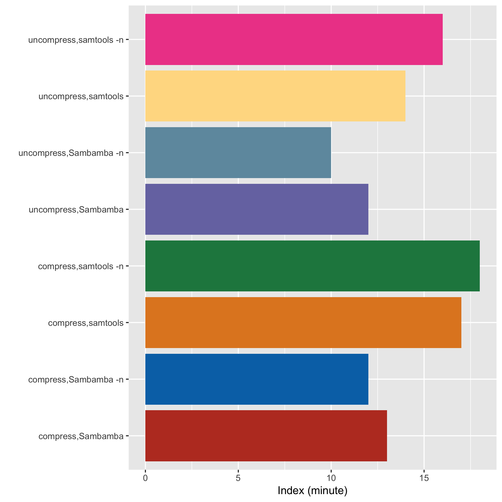
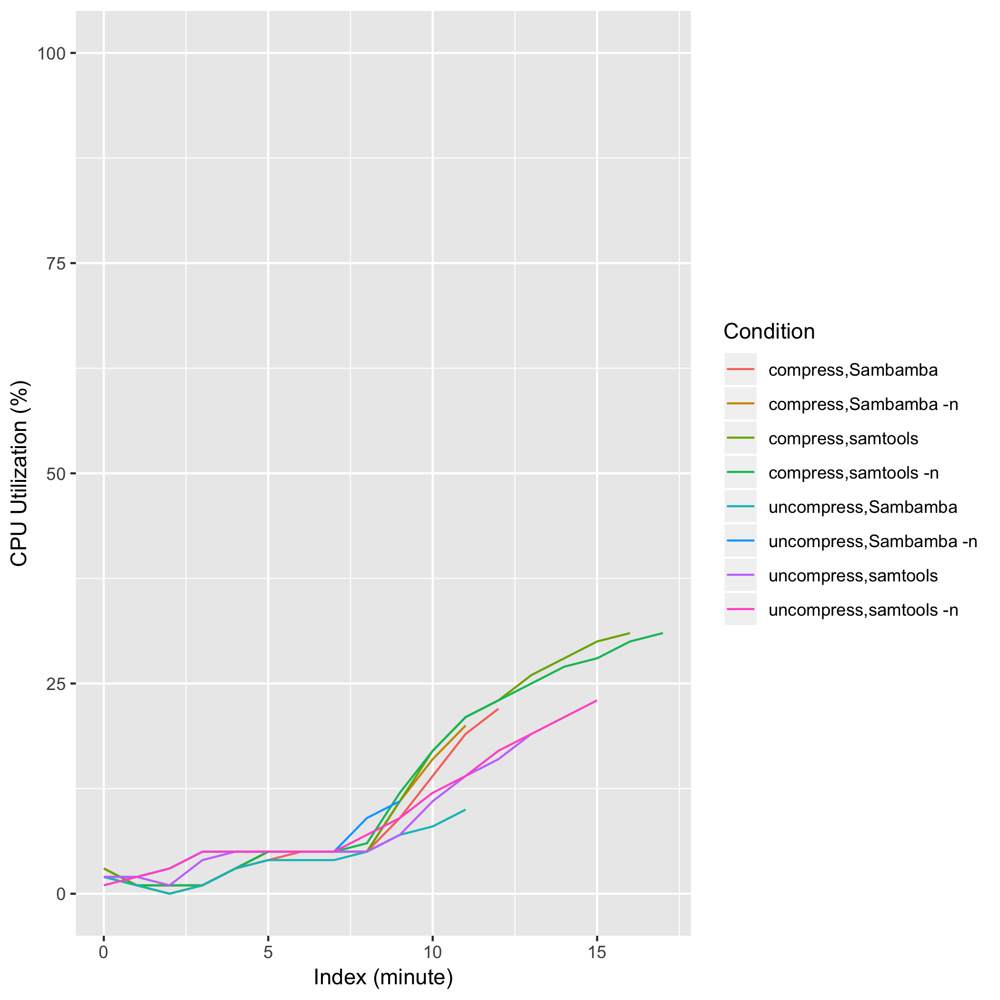
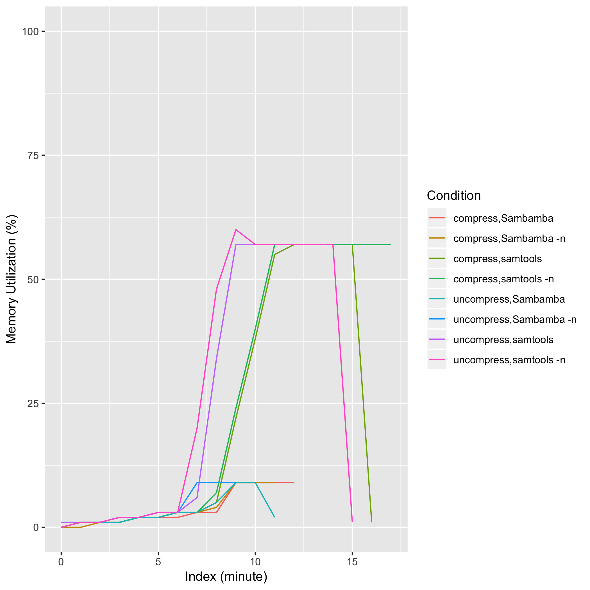
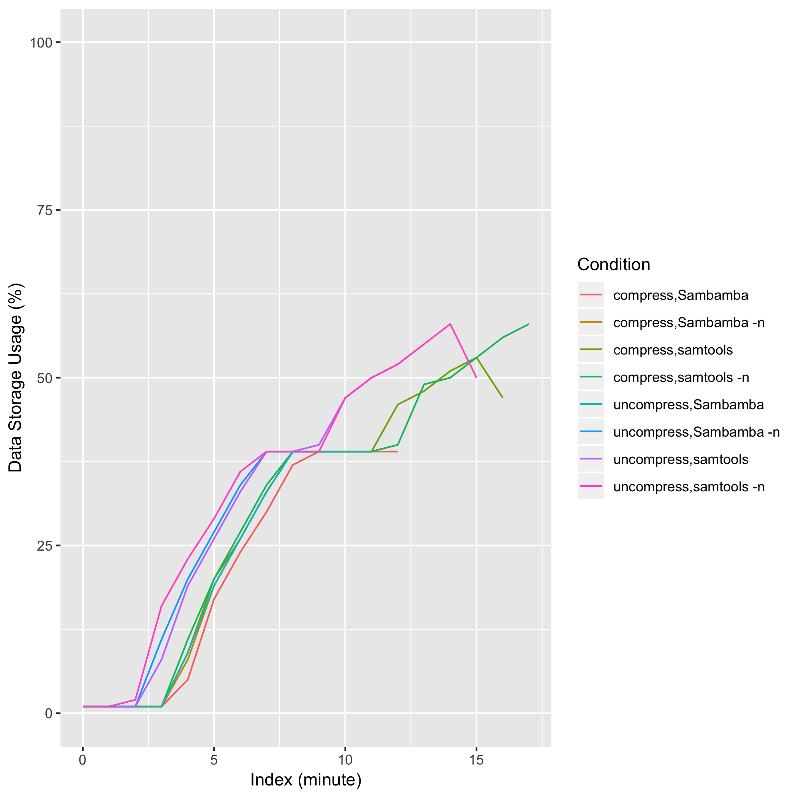

# eval_sambamba_sort

## Description
samtools view <samtools_view_option> -@ 8 <sam_file> | { samtools sort [-n] -@ 8 -m 4G | sambamba sort [-n] -t 8 -m 4G }

## Computing Environment
m5.4xlarge spot instance - 16 cpu, 64GiB memory, 120GB EBS

## Running Time

## CPU Utilization

## Memory Utilization

## Disk Storage Usage

