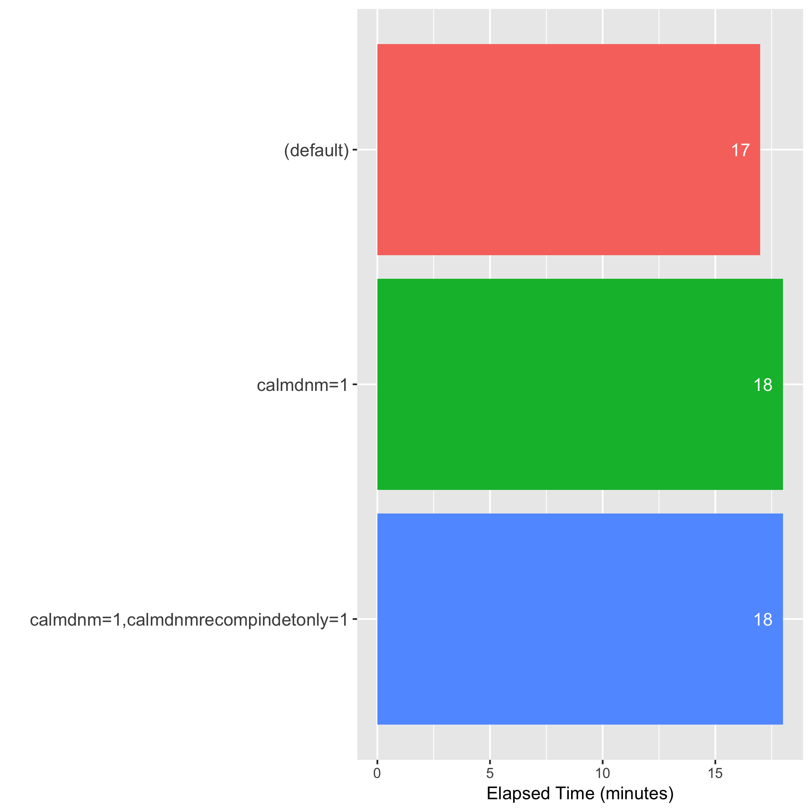
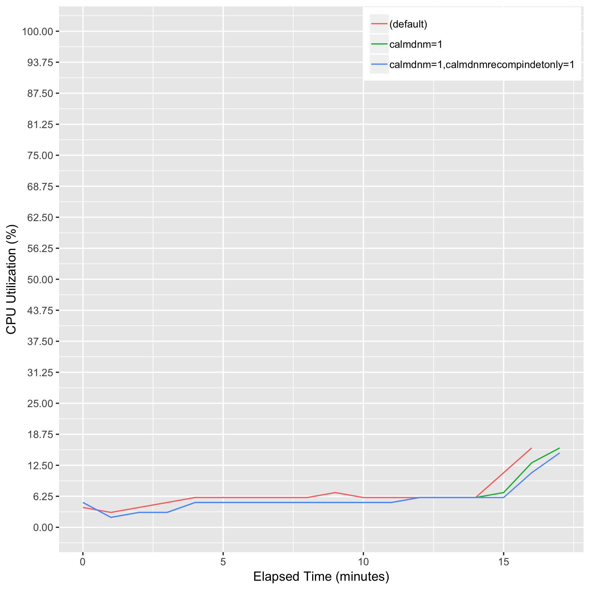
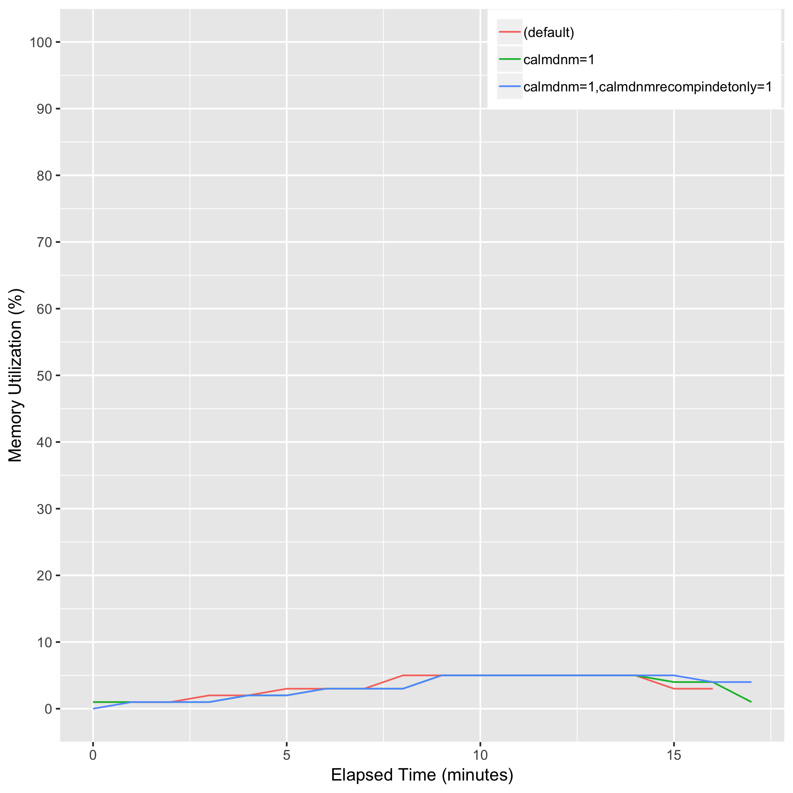

# eval_biobambam_sort_calmdnm

## Description
bamsort [calmdnm=1 [calmdnmrecompindetonly=1] calmdnmreference={reference}] outputthreads=15 inputformat=sam outputformat=bam I={sam_file} O={bam_file}

## Computing Environment
aws m5.4xlarge EC2 spot instance - 16 cpu, 64GiB memory, 120GB EBS

## Running Time

## CPU Utilization

## Memory Utilization

## Disk Storage Usage

