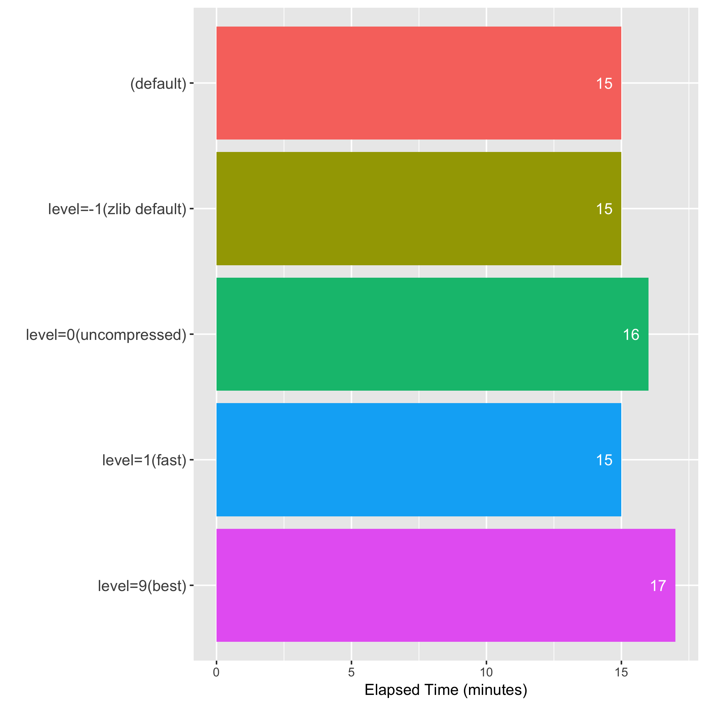
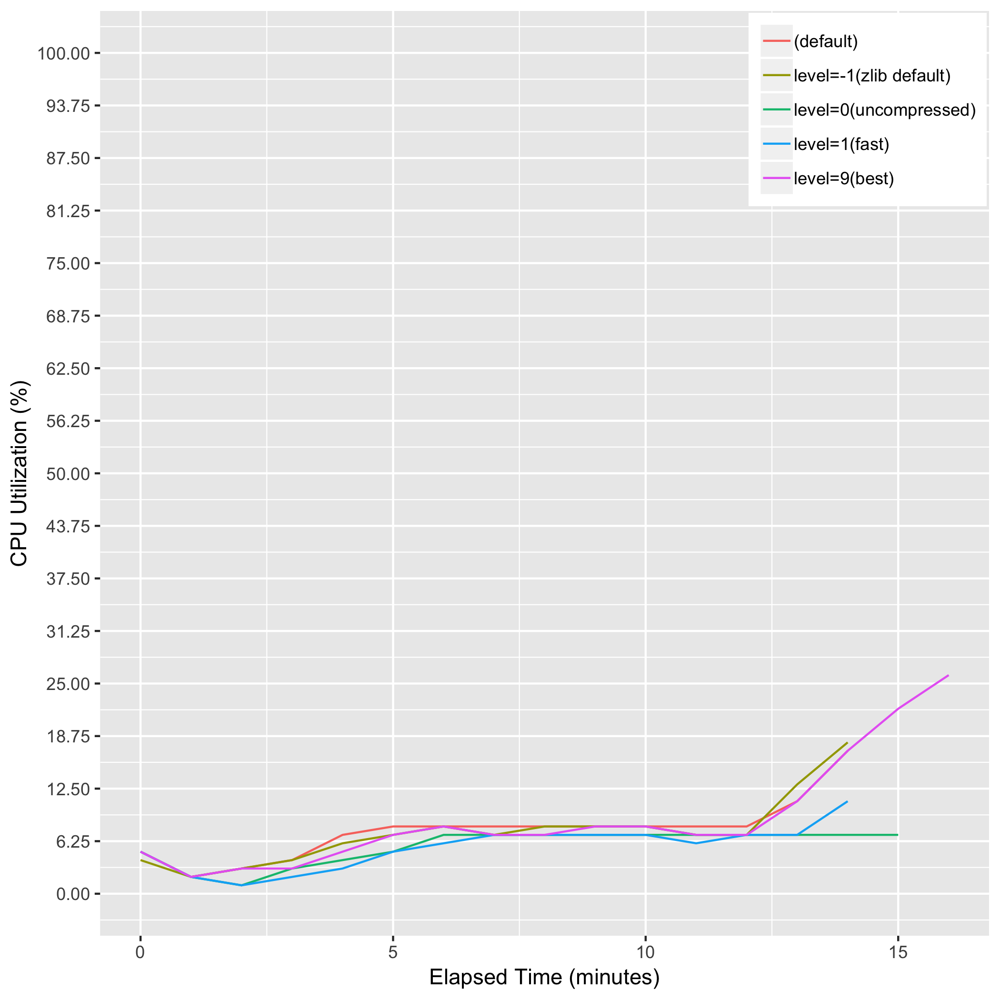
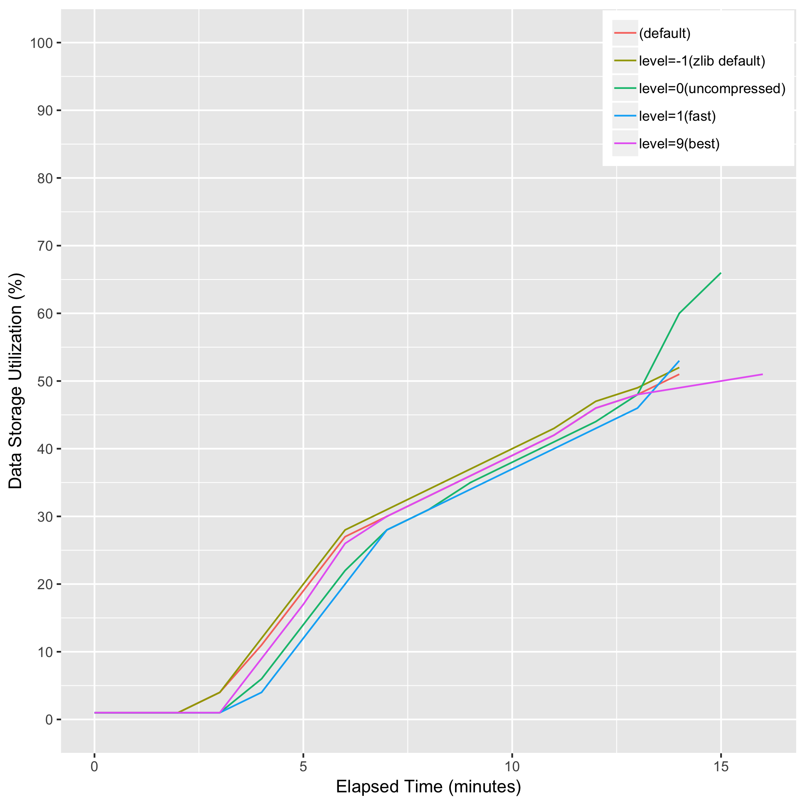

# eval_biobambam_sort_compress

> Note: "level=0" has failed with the following error.
>> terminate called after throwing an instance of 'libmaus::exception::LibMausException'
>> what(): failed to write compressed data to bgzf stream.

## Description
bamsort [level={-1|0|1|9}] inputformat=sam outputthreads=15 outputformat=bam I=input.sam O=output.bam

## Computing Environment
aws m5.4xlarge EC2 spot instance - 16 cpu, 64GiB memory, 120GB EBS

## Running Time

## CPU Utilization

## Memory Utilization

## Disk Storage Usage

