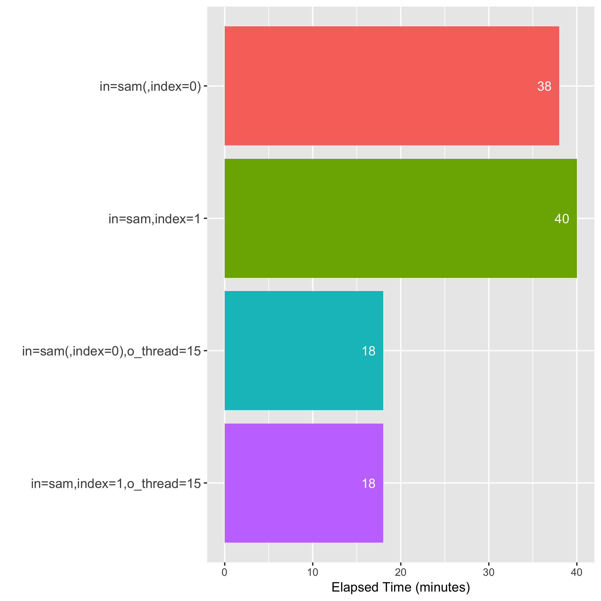
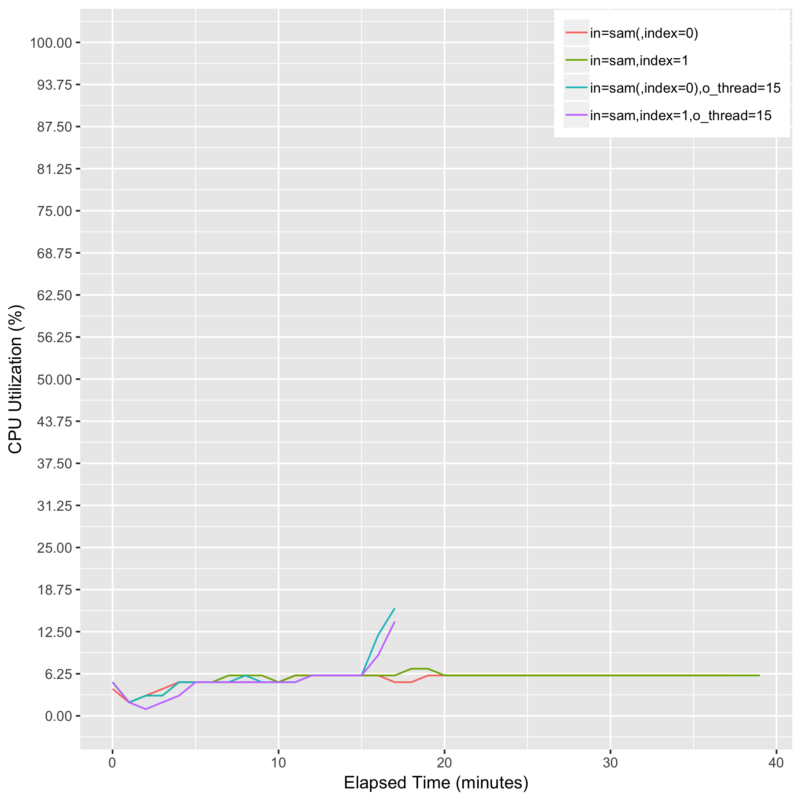
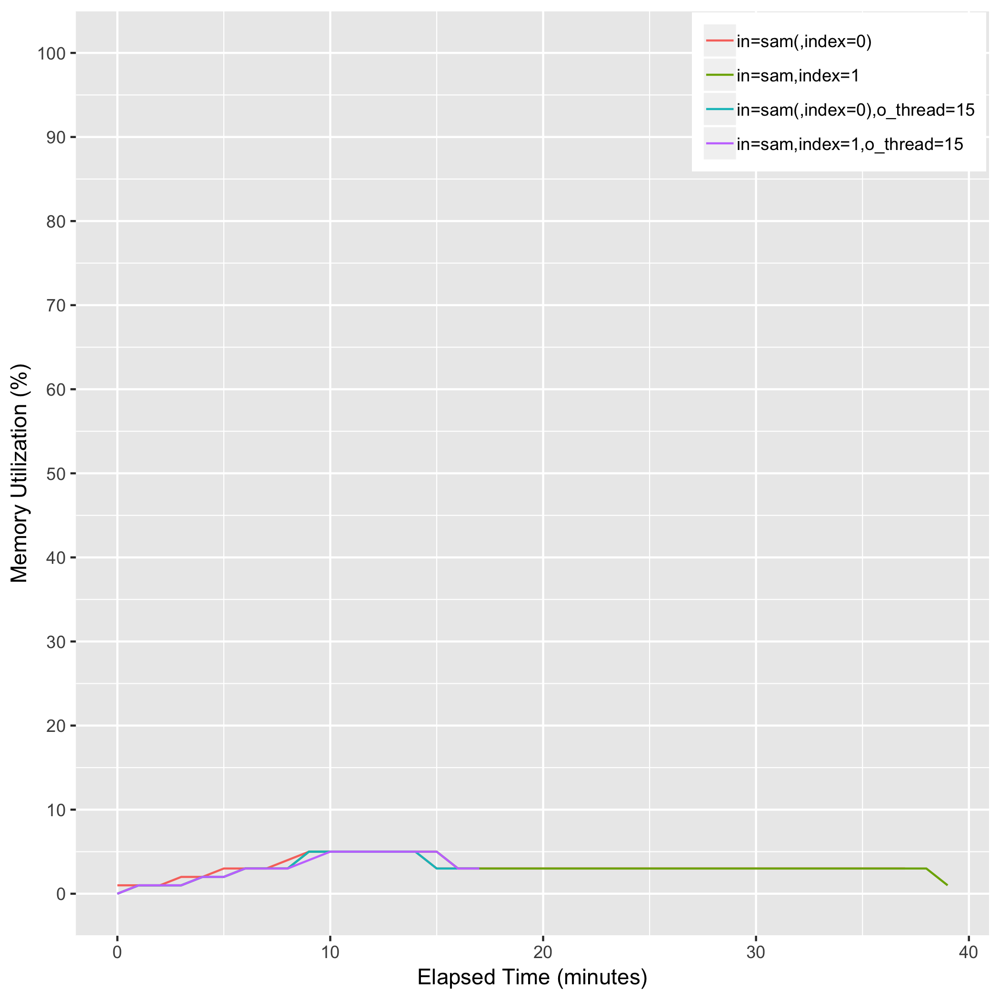

# eval_biobambam_sort_index

## Description
bamsort [index=1] [outputthreads=15] inputformat=sam outputformat=bam I=input.sam O=output.bam --tmpfile=/scratch

## Computing Environment
aws m5.4xlarge EC2 spot instance - 16 cpu, 64GiB memory, 120GB EBS

## Running Time

## CPU Utilization

## Memory Utilization

## Disk Storage Usage

