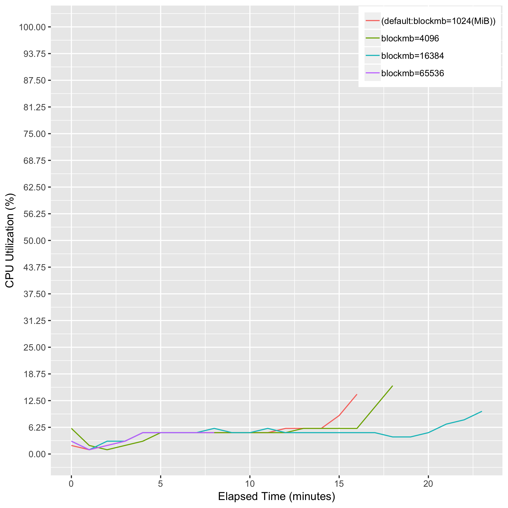
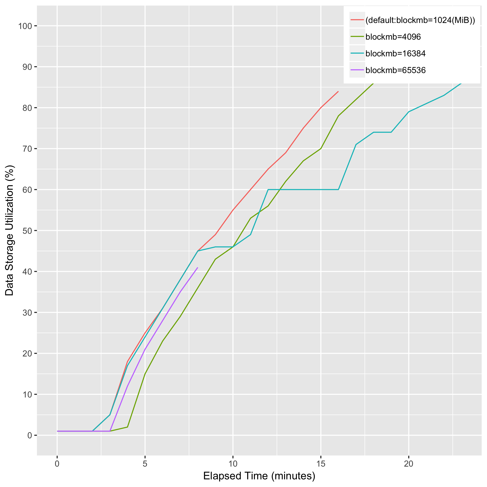

# eval_biobambam_sort_memory

Note: "blockmb=65536" has failed with the memory allocation error.

## Description
bamsort [blockmb={1024|4096|16384|65536}] inputformat=sam outputthreads=15 outputformat=bam I=input.sam O=output.bam

## Computing Environment
aws m5.4xlarge EC2 spot instance - 16 cpu, 64GiB memory, 120GB EBS

## Running Time

## CPU Utilization

## Memory Utilization

## Disk Storage Usage

