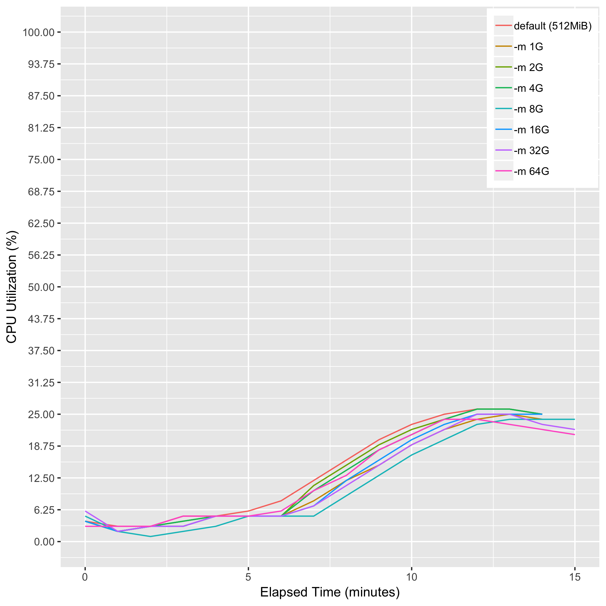
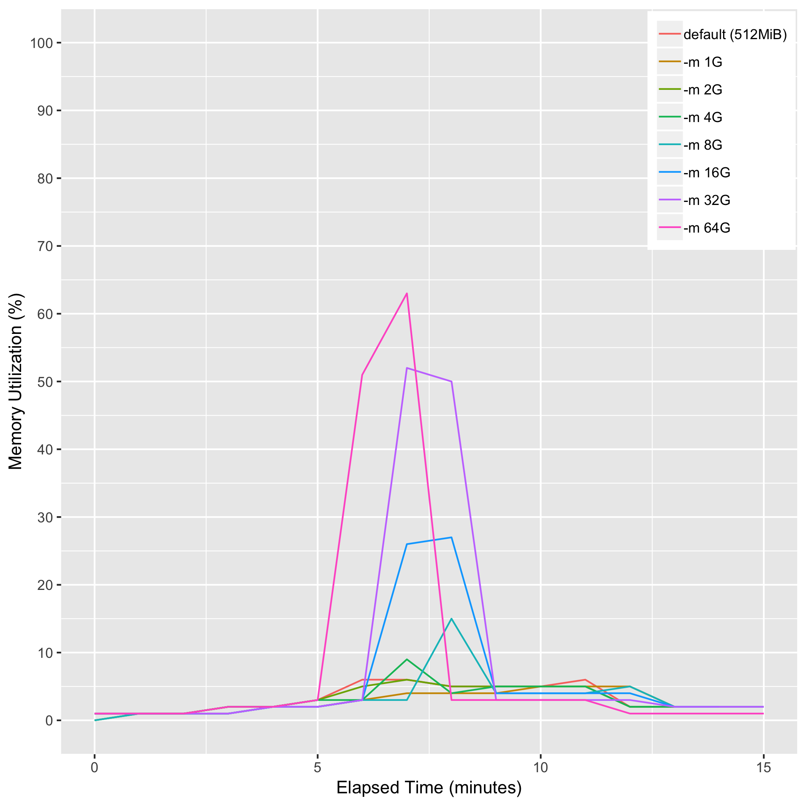
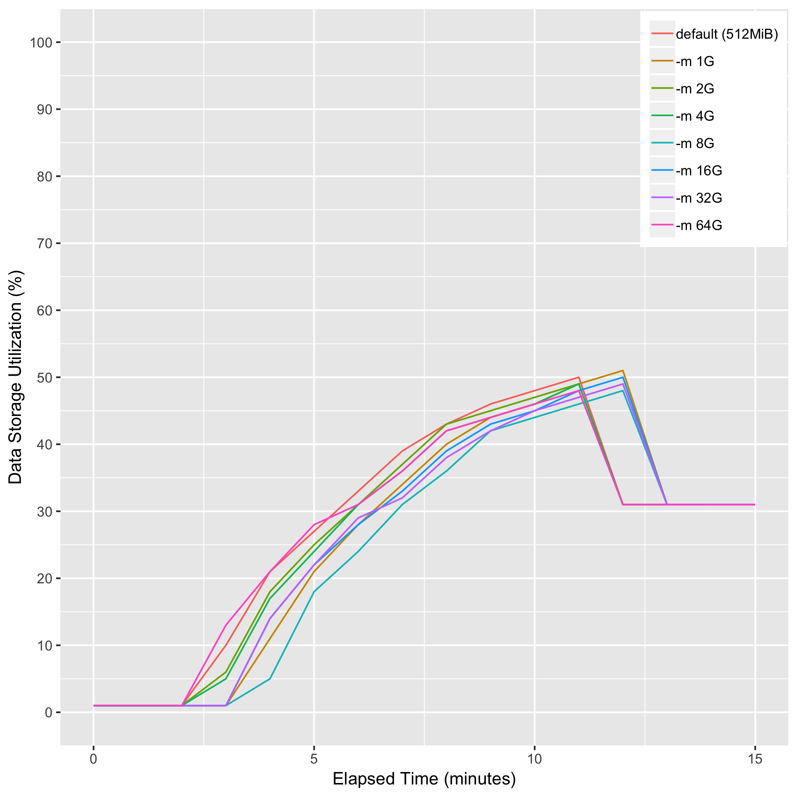

# eval_sambamba_sort_memory

## Description
sambamba sort [-m {1G|2G|4G|8G|16G|32G|64G}] -t 8 --tmpdir /scratch -o sorted_bam unsorted_bam

## Computing Environment
aws m5.4xlarge EC2 spot instance - 16 cpu, 64GiB memory, 120GB EBS

## Running Time

## CPU Utilization

## Memory Utilization

## Disk Storage Usage

