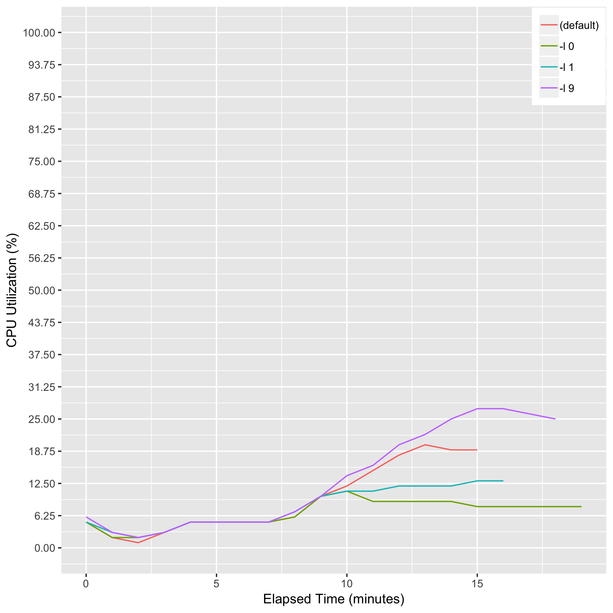

# eval_samtools_sort_compress

## Description
samtools sort -@ 8 [-l {0|1|9}] {input_bam} -o {output_bam}  Note: "-l" is compression level, from 0 (uncompressed) to 9 (best).

## Computing Environment
m5.4xlarge Amazon EC2 spot instance - 16 cpu, 64GiB memory, 120GB EBS

## Running Time

## CPU Utilization

## Memory Utilization

## Disk Storage Usage

