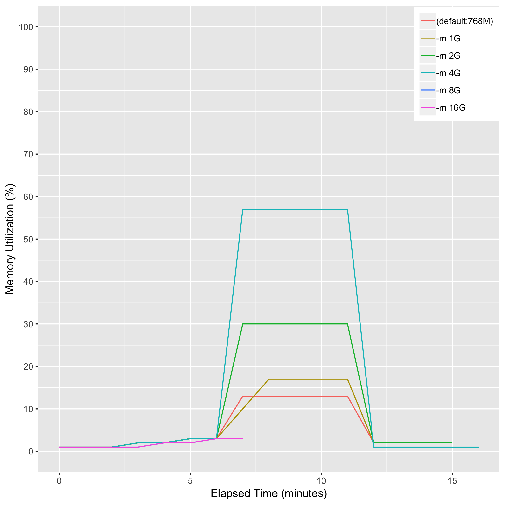
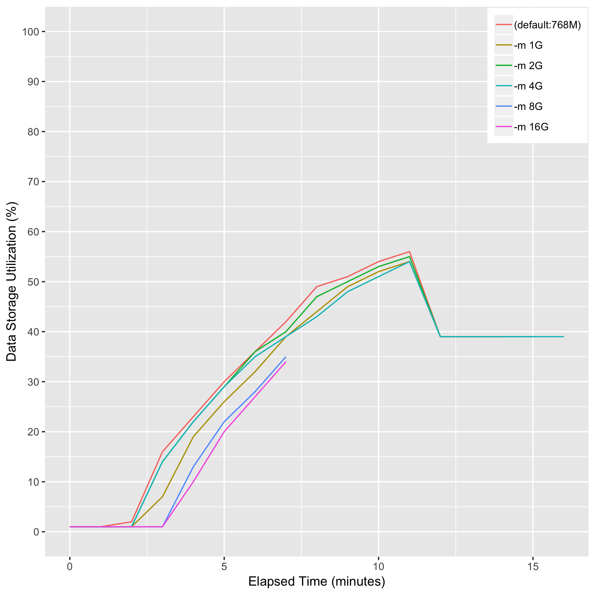

# eval_samtools_sort_memory

> Note: "-m 8G and -m 16G" failed with the memory allocation error.

## Description
samtools sort -@ 8 [-m {1G|2G|4G|8G|16G}] {input_bam} -o {output_bam}  Note: "-m" is maximum memory per thread; suffix K/M/G recognized. [768M]

## Computing Environment
aws m5.4xlarge EC2 spot instance - 16 cpu, 64GiB memory, 120GB EBS

## Running Time

## CPU Utilization

## Memory Utilization

## Disk Storage Usage

