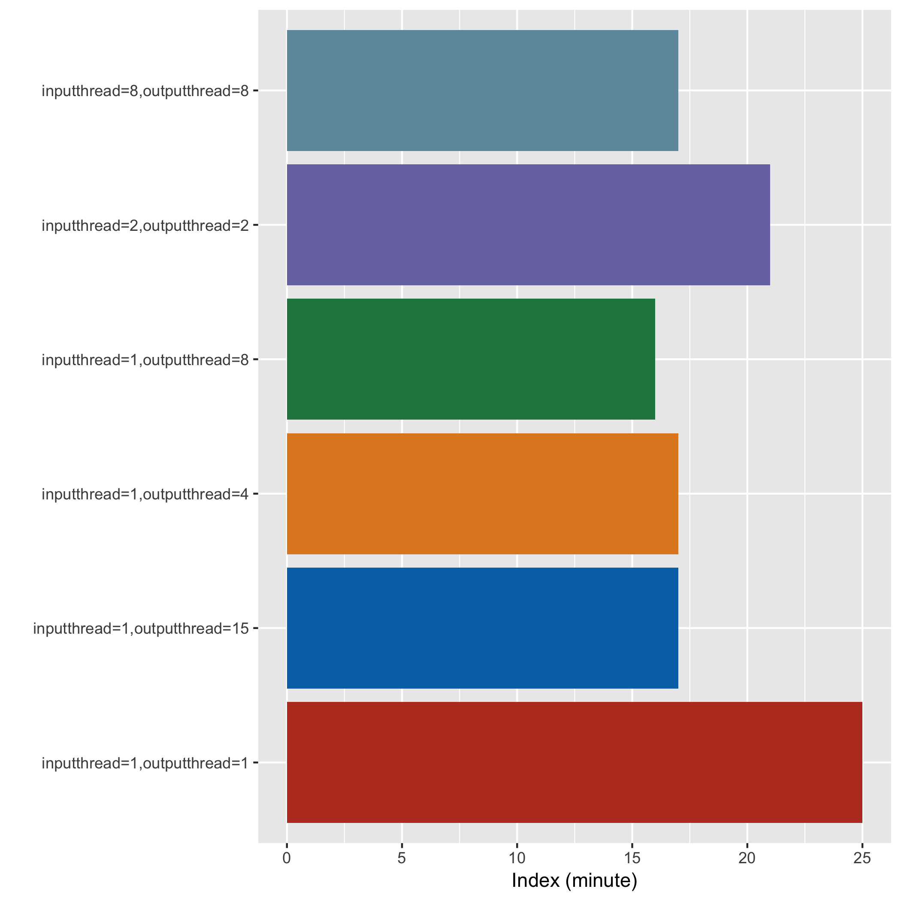
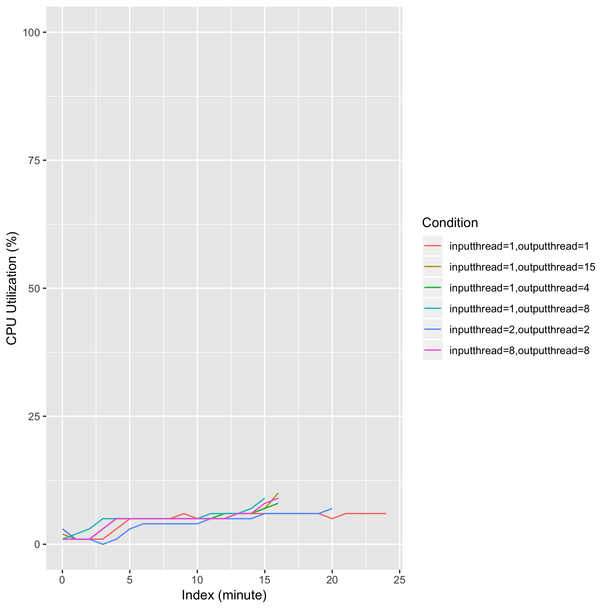
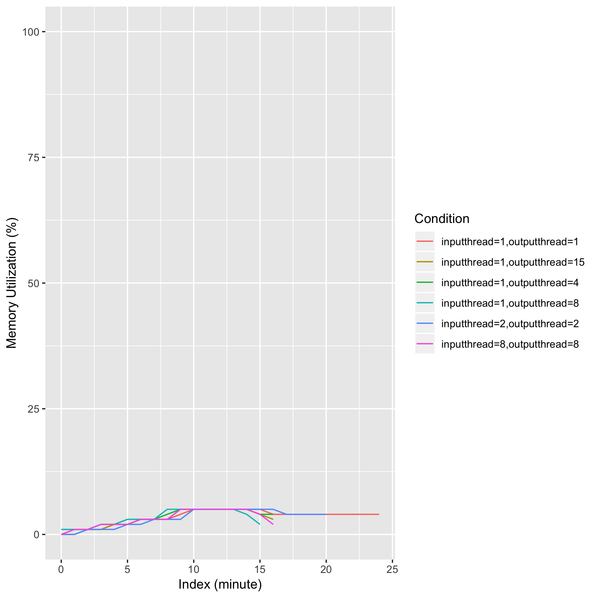
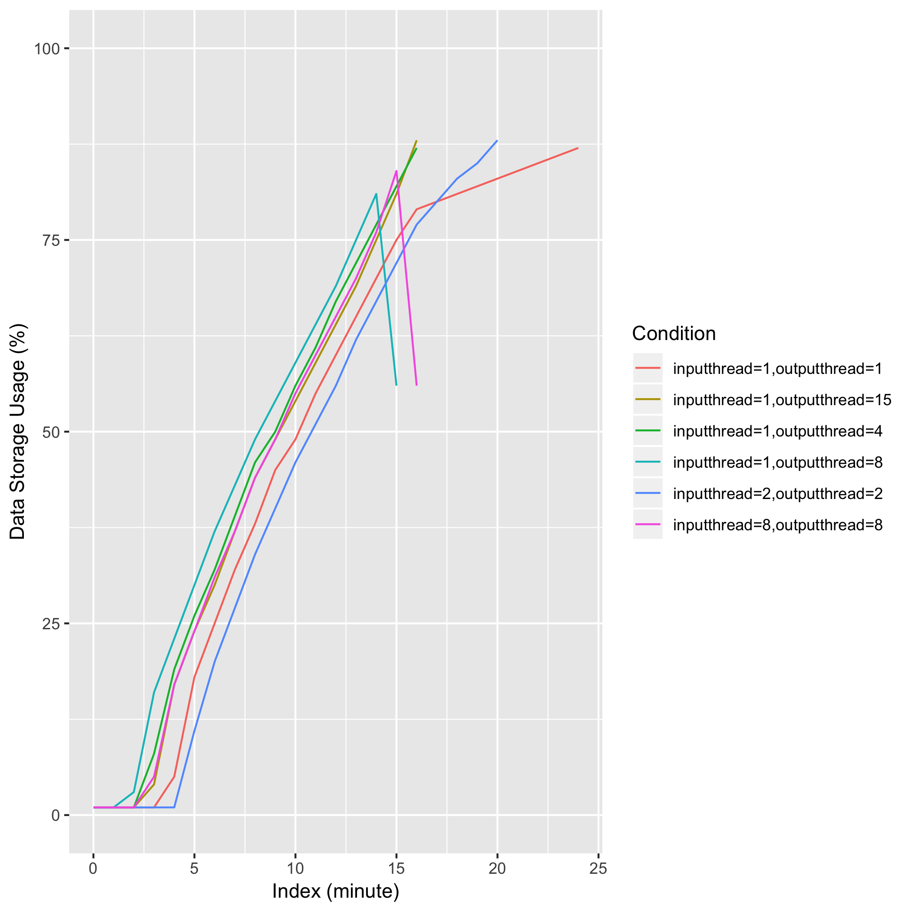

# eval_biobambam_sort_complex

## Description
bamsort inputthreads={thread} outputthreads={thread} inputformat=sam outputformat=bam I={sam_file} O={bam_file} index=1 level=1 calmdnm=1 calmdnmrecompindentonly=1 calmdnmreference={reference} indexfilename={bai_file}

## Computing Environment
aws m5.4xlarge EC2 spot instance - 16 cpu, 64GiB memory, 120GB EBS

## Running Time

## CPU Utilization

## Memory Utilization

## Disk Storage Usage

